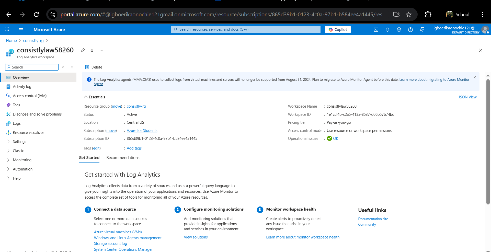

# Phase Submission

## Live Public URL

https://consistly-backend--2p95jzb.purplehill-432068c5.centralus.azurecontainerapps.io

## Screenshots of Provisioned Resources

## Peer Review

_Link to the Pull Request you reviewed for your peer:_

[PR REVIEWED: <insert-peer-pr-link-here>]

## Reflection

### Challenges of Infrastructure as Code (IaC)

- Managing state files securely and avoiding secrets in version control was a key challenge.
- Debugging resource dependencies and Azure region restrictions required careful reading of error messages and documentation.
- Terraform's error messages can be cryptic, especially when resources are in a failed state or need to be imported.

### Challenges of Manual Deployment

- Ensuring the Docker image was built and pushed correctly to ACR before deployment.
- Dealing with Azure Container App provisioning failures due to missing images or credentials.
- The need to manually intervene in the Azure Portal to delete failed resources before Terraform could proceed.

### Lessons Learned

- Always add sensitive files (like terraform.tfstate) to .gitignore from the start.
- Use Terraform outputs to track important resource URLs and credentials.
- Manual deployment is a good learning experience, but automating the process is more reliable and less error-prone in production.
